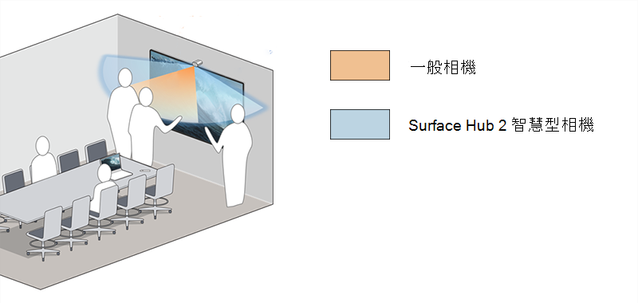

# 安裝和管理 Surface Hub 2 智慧相機

Surface Hub 2 Smart Camera1   是專為混合式小組所設計，並已針對遠端參與者進行優化。 透過著重于前景和背景，遠端參與者可以看到人員與Surface Hub上的內容互動，同時也會檢視會議室中的其他人。 Surface Hub 2 智慧相機具有大於 136 度的寬視野、自動框架、高品質的玻璃光學，以及低光感應器。

*超寬相機檢視包含在 85 吋中樞的極端邊緣上將人員白板化*

## 系統需求

針對執行 Team OS 的 Surface Hub，Surface Hub 2 智慧相機需要下列更新[，Windows 10 團隊版 2020 更新](surface-hub-2020-update-whats-new.md) (20H2) Surface Hub 2：

- Windows 10 團隊版 2020 Update 2 (KB5010415 或後續Windows更新) 
- 系統硬體更新 - 2022 年 1 月 21 日 (或後續的系統硬體更新) 

若要深入瞭解，請參閱[Surface Hub更新歷程記錄](surface-hub-update-history.md)。

> [!NOTE]
> 移轉的 Surface Hub 不需要額外的更新，即可執行Windows 10或Windows 11 專業版/Enterprise。

## 安裝智慧相機

1. 將相機附加至 Surface Hub 2 頂端中間的 USB-C 埠。 當相機連接時，指標 LED 會短暫亮起，並在相機使用中時持續亮起。

     

2. 若要移除相機，請上下拉。 磁性系結可防止相機往後關閉或拉動。

    

> [!TIP]
> 相機會在不使用時，以磁性方式貼齊前端以供隱私權使用，並以磁性方式貼齊儲存空間。

## 管理自動框架設定

當您四處移動時，自動框架動態縮放並讓您置中于影片中。 您管理設定的方式取決於安裝在 Surface Hub 上的 OS：

- [Windows 10 團隊版 2020 更新 (20H2) ](#windows-10-team-2020-update-20h2)
- [Surface Hub上的 Windows 11 Desktop](#windows-11-desktop-on-surface-hub)
- [Windows 10桌面Surface Hub](#windows-10-desktop-on-surface-hub)

### Windows 10 團隊版 2020 更新 (20H2) 

當您安裝Surface Hub智慧相機時，預設會啟用自動框架處理。 系統管理員可以透過開啟/關閉切換，從設定管理自動框架處理，以設定每個Surface Hub會話開始時的自動框架處理狀態。

**若要調整自動框架：**

1. 在您的 Surface Hub 2S 上，以**系統管理員身分登入**。

> [!NOTE]
> 如果您不知道您的使用者名稱或系統管理員密碼，則必須重設裝置。 如需詳細資訊，請[參閱重設和復原Surface Hub 2S](/surface-hub/surface-hub-2s-recover-reset)。

2. 開**啟 [設定**]，然後移至 **[Surface Hub >通話&音訊]。**
3. 在 **[自動框架**化] 下，視需要調整切換。 
4. 選 **取 [結束會話]**;當您啟動新的會話時，會套用修改過的設定。 

如果切換設定為 [**開啟**]，當使用者在Surface Hub上開始會話時，預設一律會開啟自動框架。 如果切換設定為 **[關閉]**，在 Surface Hub 上啟動會話時，自動框架處理預設一律會關閉。

#### 透過 MDM 提供者管理相機設定

系統管理員可以透過 Intune 或協力廠商行動裝置管理 (MDM) [提供者的Surface Hub設定服務提供者](/windows/client-management/mdm/surfacehub-csp) (CSP) 來管理自動框架處理。

|CSP 原則設定| 描述|
|------------------|------------|
|DefaultAutomaticFraming|如果您開啟此原則設定，則會啟用自動框架處理。 如果您關閉此原則設定，則會停用自動框架處理。 如果您未設定此原則設定，則會啟用自動框架處理。 |

若要深入瞭解，請參閱下列各項：

- [使用 MDM 提供者管理設定](/surface-hub/manage-settings-with-mdm-for-surface-hub#create-custom-configuration-profile)
- [SurfaceHub CSP - Windows用戶端管理](/windows/client-management/mdm/surfacehub-csp)

### Surface Hub上的 Windows 11 Desktop

如果您已[移轉Surface Hub](surface-hub-2s-migrate-os.md)以執行Windows 11 專業版或Windows 11 企業版，則必須為Surface Hub智慧相機開啟自動框架處理。 根據預設，自動框架會關閉。

若要開啟自動框架處理，請移至**設定 > 藍牙 &裝置>管理相機> Surface Hub 2 智慧相機。**

### Windows 10桌面Surface Hub

自動框架處理一律會啟用，而且無法停用或以其他方式設定。

## 訂購 Surface Hub 2 智慧相機

向授權的[Microsoft Surface 轉銷商](https://www.microsoft.com/surface/business/where-to-buy-microsoft-surface?)購買 Surface Hub 2 智慧相機。

### 參考

1. Surface Hub 2 智慧相機，自 2022 年 3 月 16 日起分別銷售，可動態調整遠端參與者的視訊摘要。 從 2022 年 5 月開始，Surface Hub 2 智慧相機會包含在Surface Hub 2S 85" 的方塊中。
