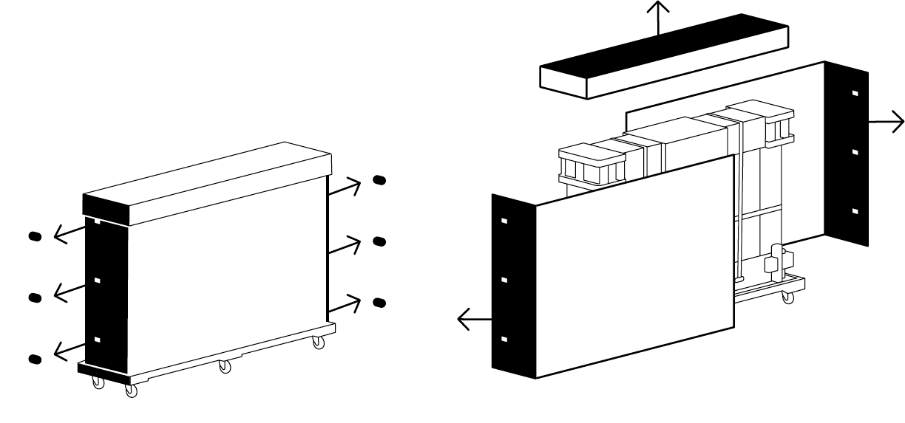
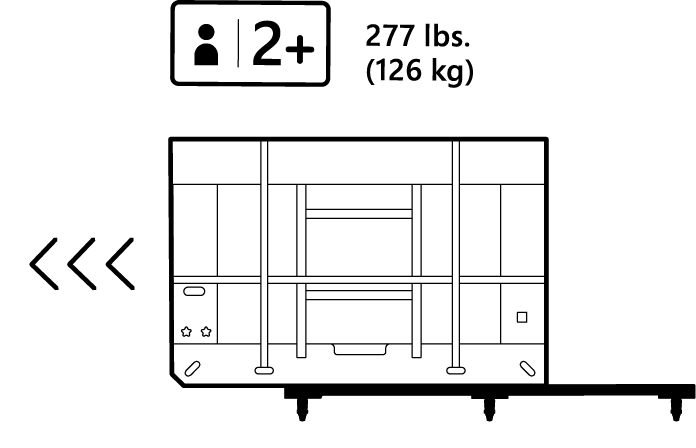
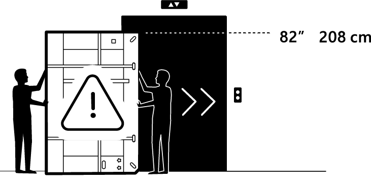
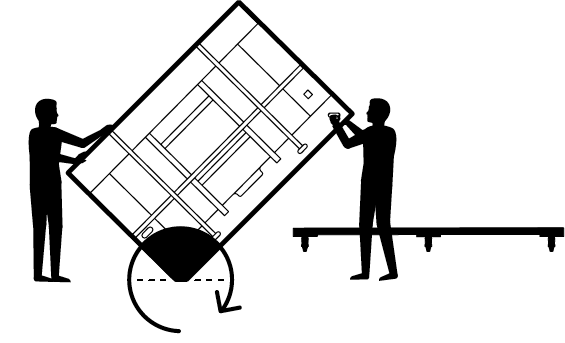
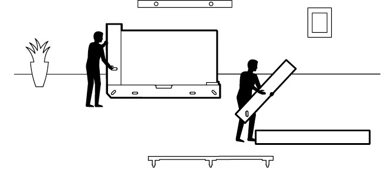
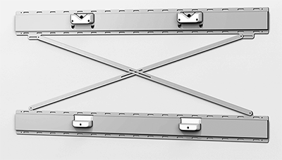
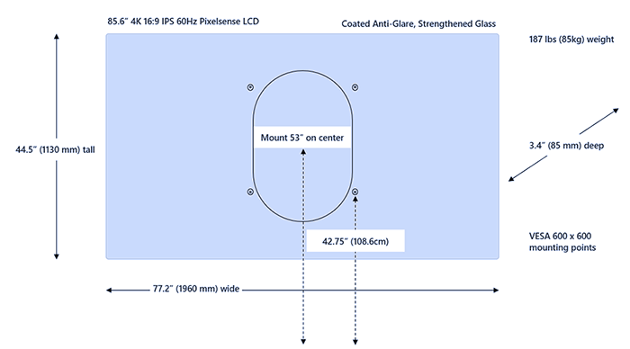
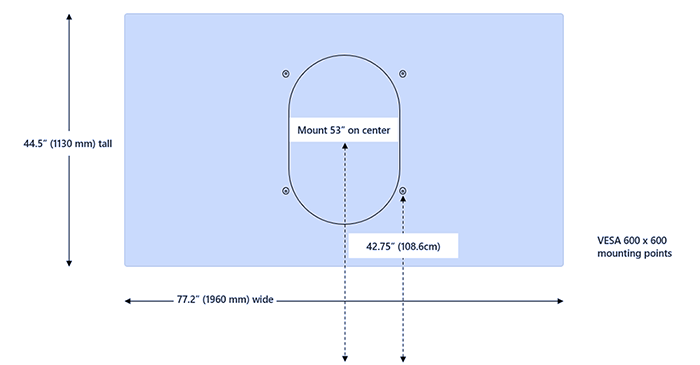

# 安裝並安裝 Surface Hub 2S 85"

本文提供在商業環境中實際安裝 2S Microsoft Surface Hub 2S 85" 的支援指南。 

## 取消盒式影片

- 開始之前，請先Microsoft Surface Hub 2S 85" 取消框和設定影片：

>[!VIDEO https://www.microsoft.com/en-us/videoplayer/embed/RWwwgL]

## 遵循所有安全注意事項 

> [!WARNING]
> **處理和網站準備** 
> - 裝置非常重。 若要降低因裝置大小和重量而造成個人傷亡、死亡或損毀的風險，保持裝置直立很重要。
>- 在將裝置移至安裝位置之前，請調查網站，決定如何安全地將裝置移到要解壓縮並安裝的位置。
>- 請至少使用兩個人來解壓縮和安裝。
>- 裝置解壓縮後，應該立即安裝，因此在解壓縮之前，安裝系統應該就位。 如果您要安裝在滾動支架上，請鎖定或封鎖支架的轉輪，然後再解壓縮。
>- 為了避免脫扣危險，請保持元件區域沒有包裝材料。

> [!IMPORTANT]
>在繼續進行之前，請查看下列附件 A 所列的 [其他](#appendix-a-additional-safety-information) 安全資訊。

## 1. 移除外部包裝材料

1. 移除及回收外蓋。
2. 剪下四 (4) 塑膠帶。
3. 開啟並移除六個 (6 個) 剪輯。
4. 移除蓋，然後解除並移除前後面板。

   

## 2. 移除黑色外包裝泡泡

1. 移除黑色角落的泡泡 (4) 。
2. 移除黑色中心泡泡支援。

   

> [!Caution]
> 請勿移除任何白色泡泡、帶狀或包裝材料，直到 Hub 2S 與放置該容器的購物車或牆面安裝座相鄰。
其他系帶材料會放在封裝背面的手式螺旋式按鈕下的小方塊中。 在移動前，尤其是旋轉裝置及其保護套件之前，必須先將原始或取代的系帶材料放在原處。
 

## 3. 從貨盤移除內部包裝框架

1. 將貨盤元件移至提升位置。
2. 鎖定 4 到 4 (輪) 。
3. 將內包裝從貨盤上滑動。

   

## 4. 旋轉包裝框架以配合提升

1. 旋轉框架以配合提升
2. 在內部框架的斜面端旋轉，然後滑動到乘用卡。

   

> [!TIP]
> 轉輪式貨盤可自訂配合內部框架包裝的封裝，並可用於整個安裝網站傳遞程式。 內部木框架端部有鋼制滑板。
 
## 5. 從提升裝置移除

1. 滑出乘機
2. 鎖定 x4 軸 (輪) 。

   

## 6. 將 Surface Hub 85" 放回貨盤

1. 使用斜面端，旋轉回託盤。
2. 解除鎖定 x4 (輪) 。
3. 將產品移至牆面或購物車安裝的位置。

   

## 7. 將 Surface Hub 85" 放在牆面安裝或購物車

1. 將 Hub 2S 放在牆面安裝或購物車的前方。
2. 鎖定 x4 軸 (輪) 。
3. 將內包裝從貨盤上滑動。
4. 剪下 3 根塑膠帶。
5. 移除蓋。
6. 移除白色泡泡碎片。
7. 移除歡迎套件。
8. 垂直提升以移除端部。
9. 使用木材基座上的四個手用按鈕釘移除木端部分。

     

   > [!CAUTION]
   >  請勿讓 Hub 2S 85" 處於無人看管狀態。 需要另一個人來讓裝置保持直立。 移除端部之後，至少需要一個人與 Hub 2S 保持聯絡，直到放置於牆面安裝或購物車完成為止。

10. 將膠合板端片向上和返回。
11. 從背面移除凸凸標籤。
12. 將 Hub 2S 從下層盤中取出，並放在購物車或牆面安裝裝置上。

    > [!NOTE]
    > 按照購物車或牆面安裝製造指示，在將 Hub 2S 從內部包裝盤移除之前，先準備安裝系統。
 
    > [!TIP]
    > 當握住 Hub 2S 時，請注意，手部在較低的泡泡中剪下。 您必須小心使用上手，不要握住喇叭所在的裝置。 裝置外蓋兩端的圖形提供一般喇叭位置。

13. 將彈性拉力夾 (x2) 。
14. 移除布蓋。
15. 記下放置 x2 (、) 和電源線的觸控筆位置。
16. 在 x2 (、) 和電源線上附加觸控筆。
17. 移除 x4 (上的) 。
18. 按右下角的電源按鈕。 安裝現已完成。

 

 
## 安裝 Surface Hub 2S 85" 

2S Surface Hub 85" 採用 600 x 600 VESA 安裝模式。 如下圖所示，Microsoft 已與[Steelcase](https://www.steelcase.com/products/collaboration/steelcase-roam/)合作，以建立與 2S 85" Surface Hub相容的安裝選項。 

  

### 安裝尺寸

如果您使用其他 (非 Steelcase) 安裝選項，則需要使用空白字元號來說明裝置背面的計算區。 從薩凡德設計提供空格器和其他經過認證的 [配件](http://www.salamandercommercial.com/surface-hub-2)。

  

  

## 補充系帶套件

附加于右下角的套件中，可找到一組額外的內包裝系帶材料。

## 附件 A：其他安全資訊

> [!WARNING]
> **重物/人體工學提升** 
> 裝置非常重。 若要降低與提升相關的傷害、死亡或裝置損壞的風險，我們建議您至少讓兩名以上人員解除裝置。 在提升和/或移動裝置時，使用適當的提升方式非常重要。
> 使用良好的人體工學提升練習，包括但不限於：
> - 提前規劃。 確認提升小組同意計畫。
>- 判斷您是否可以解除裝置。 是否太重或太尷尬？
>- 決定是否需要提升輔助裝置。
>- 檢查您的環境是否發生障礙和滑滑表面。
>- 以您的雙腳而非背背來提升。
>- 彎曲膝部，讓背保持直線。
>- 讓裝置靠近您的身體。
>- 將身體中央位於裝置上。 讓雙腳與雙腳分開。
>- 順暢地向上提升。
>- 保持您的直向;提升時或提升負載之後，請勿扭曲

> [!WARNING]
>  **正確安裝**  裝置很重，並連接到購物車或牆面安裝。 若要降低裝置受傷、死亡或損毀的風險： 
>- 遵循購物車或牆面安裝製造商提供的所有指示。
>- 確保建議的安裝系統支援此裝置重量。
>- 只能使用安裝系統時所提供的安裝硬體。
>- 請依照製造商的指示，確保所有的螺絲都安全固定。
>- 請勿放開裝置，直到您確定裝置與安裝系統附件點完全連接。
>- Microsoft 建議使用專為您的裝置所設計的購物車或牆面安裝系統。 Microsoft 對於使用其他安裝系統所造成的任何損害、傷害或死亡，不負任何責任。

> [!WARNING]
>  **牆面或其他安裝表面看不見的危害**  
牆面和其他安裝表面可能包含電線、氣管及其他看不見的危害或障礙。 剪下或切入看不見的危害可能會導致嚴重的個人傷亡或死亡。
安裝期間，安裝者有責任在安裝前找出看不見的危害，並避免這些危險。 評估安裝環境，並務必在打孔和/或剪下之前，務必確認牆面或其他安裝表面沒有看不見的危害。

> [!WARNING]
> **提示危險** 
> 若要避免在移動時造成購物車/支架裝置個人傷亡、死亡或損壞的風險：
> - 只能使用與此裝置相容的購物車/支架。
>- 請遵循購物車/支架製造商提供的所有指示，以移動或重置安裝式裝置。
>-  請勿從裝置或購物車/支架上懸掛或放置重物。
>-  在移動購物車/支架式裝置之前，請根據需要中斷電源線和其他纜線的連接。 移動購物車/支架式裝置時，請小心並緩慢移動。 按照購物車/支架製造商的指示移動或重新放置支架。
>-  在上或下斜道上或下運輸購物車/支架式裝置時，請小心。 千萬不要將推車/支架式裝置留在斜道上或附近，
>-  只有成人才能移動購物車/支架式裝置。

> [!CAUTION]
> **觸控式螢幕玻璃** 
裝置上的觸控式螢幕 ，就像大部分的觸控式螢幕一樣，是由玻璃製成。 如果裝置被丟棄或受到嚴重影響，玻璃可能會中斷。 若要降低個人傷亡的風險，請避免在玻璃損壞、切開或裂開時觸碰螢幕，並安排更換螢幕。
因不當使用或不當使用裝置而造成觸控螢幕開裂或切開，不在產品有限保固範圍內。

> [!WARNING]
>  **正確安裝** 
為了避免與裝置安裝不當相關的危險，安裝必須由在開始作業前閱讀並瞭解安裝指示的人執行。 如果您沒有必要的設備或專業知識，或是不確定安裝表面是否可正確支援，請參閱專業安裝程式。

## 其他資訊

- [Steelcase 漫遊集合](https://www.steelcase.com/products/collaboration/steelcase-roam/)
- [薩凡德設計](http://www.salamandercommercial.com/surface-hub-2)