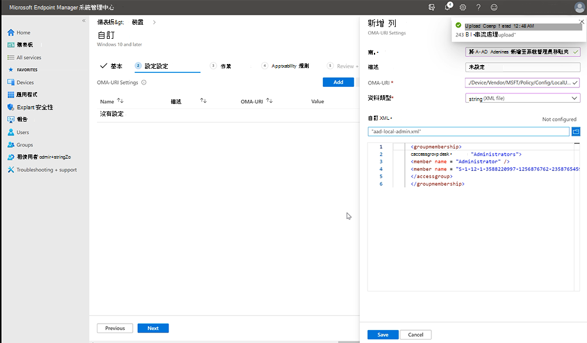

# <a name="configure-non-global-admin-accounts-on-surface-hub"></a><span data-ttu-id="bff40-104">在 Surface Hub 上設定非全域系統管理員帳戶</span><span class="sxs-lookup"><span data-stu-id="bff40-104">Configure non Global admin accounts on Surface Hub</span></span>

<span data-ttu-id="bff40-105">Windows 10 團隊版 2020 Update 新增了針對在已加入 Azure AD 網域的 Surface Hub 裝置上，將管理 設定 應用程式的許可權限制為非全域系統管理員帳戶的支援。</span><span class="sxs-lookup"><span data-stu-id="bff40-105">The Windows 10 Team 2020 Update adds support for configuring non Global admin accounts that limit permissions to management of the Settings app on Surface Hub devices joined to an Azure AD domain.</span></span> <span data-ttu-id="bff40-106">這可讓您只將系統管理員許可權範圍Surface Hub整個 Azure AD 網域上可能不想要的系統管理員存取權。</span><span class="sxs-lookup"><span data-stu-id="bff40-106">This enables you to scope admin permissions for Surface Hub only and prevent potentially unwanted admin access across an entire Azure AD domain.</span></span> <span data-ttu-id="bff40-107">開始之前，請確定您的Surface Hub已加入 Azure AD 和 Intune 自動註冊。</span><span class="sxs-lookup"><span data-stu-id="bff40-107">Before you begin, make sure your Surface Hub is joined to Azure AD and Intune auto-enrolled.</span></span> <span data-ttu-id="bff40-108">如果沒有，您必須重設 Surface Hub 並完成第一次即用即用 (OOBE) 安裝程式，加入宣告 Azure AD 的選項。</span><span class="sxs-lookup"><span data-stu-id="bff40-108">If not, you will need to reset Surface Hub and complete the first-time, out-of-the-box (OOBE) setup program, choosing the option to join Azure AD.</span></span>

## <a name="summary"></a><span data-ttu-id="bff40-109">摘要</span><span class="sxs-lookup"><span data-stu-id="bff40-109">Summary</span></span> 

<span data-ttu-id="bff40-110">建立非全域系統管理員帳戶的過程涉及下列步驟：</span><span class="sxs-lookup"><span data-stu-id="bff40-110">The process of creating non Global admin accounts involves the following steps:</span></span> 

1. <span data-ttu-id="bff40-111">在 Microsoft Intune中，建立一個安全性群組，其中包含指定管理Surface Hub。</span><span class="sxs-lookup"><span data-stu-id="bff40-111">In Microsoft Intune, create a Security group containing the admins designated to manage Surface Hub.</span></span>
2. <span data-ttu-id="bff40-112">使用 PowerShell 取得 Azure AD 群組 SID。</span><span class="sxs-lookup"><span data-stu-id="bff40-112">Obtain Azure AD Group SID using PowerShell.</span></span>
3. <span data-ttu-id="bff40-113">建立包含 Azure AD 群組 SID 的 XML 檔案。</span><span class="sxs-lookup"><span data-stu-id="bff40-113">Create XML file containing Azure AD Group SID.</span></span>
4. <span data-ttu-id="bff40-114">建立一個安全性群組，Surface Hub非全域系統管理員安全性組所管理之所有裝置。</span><span class="sxs-lookup"><span data-stu-id="bff40-114">Create a Security Group containing the Surface Hub devices that will be managed by the non-Global admins Security group.</span></span>
5. <span data-ttu-id="bff40-115">建立自訂的組組設定檔，以包含您裝置Surface Hub組。</span><span class="sxs-lookup"><span data-stu-id="bff40-115">Create a custom Configuration profile targeting the security group that contains your Surface Hub devices.</span></span> 


## <a name="create-azure-ad-security-groups"></a><span data-ttu-id="bff40-116">建立 Azure AD 安全性群組</span><span class="sxs-lookup"><span data-stu-id="bff40-116">Create Azure AD security groups</span></span>

<span data-ttu-id="bff40-117">首先建立包含系統管理員帳戶的安全性組。</span><span class="sxs-lookup"><span data-stu-id="bff40-117">First create a security group containing the admin accounts.</span></span> <span data-ttu-id="bff40-118">然後為裝置建立另一個Surface Hub組。</span><span class="sxs-lookup"><span data-stu-id="bff40-118">Then create another security group for Surface Hub devices.</span></span>  

### <a name="create-security-group-for-admin-accounts"></a><span data-ttu-id="bff40-119">為系統管理員帳戶建立安全性群組</span><span class="sxs-lookup"><span data-stu-id="bff40-119">Create security group for Admin accounts</span></span>

1. <span data-ttu-id="bff40-120">透過系統管理中心[Microsoft 端點管理員](https://go.microsoft.com/fwlink/?linkid=2109431)Intune，選取組>群組類型\*\*\*\*，然後選取  >  \*\*\*\* 安全性 **。**</span><span class="sxs-lookup"><span data-stu-id="bff40-120">Sign into Intune via the [Microsoft Endpoint Manager admin center](https://go.microsoft.com/fwlink/?linkid=2109431), select **Groups** > **New Group** > and under Group type, select **Security.**</span></span> 
2. <span data-ttu-id="bff40-121">輸入組名 ，例如，Surface Hub**管理員**，然後選取建立 **。**</span><span class="sxs-lookup"><span data-stu-id="bff40-121">Enter a Group name -- for example, **Surface Hub Local Admins** -- and then select **Create.**</span></span> 

     

3. <span data-ttu-id="bff40-123">開啟群組 **，選取成員**，然後選擇新增成員，\*\*\*\* 以在 Surface Hub 中輸入要指定為非全域系統管理員的系統管理員Surface Hub。</span><span class="sxs-lookup"><span data-stu-id="bff40-123">Open the group, select **Members**, and then choose **Add members** to enter the Administrator accounts that you wish to designate as non Global admins on Surface Hub.</span></span> <span data-ttu-id="bff40-124">若要深入瞭解在 Intune 中建立群組，請參閱新增  [群組以組織使用者和裝置](/mem/intune/fundamentals/groups-add)。</span><span class="sxs-lookup"><span data-stu-id="bff40-124">To learn more about creating groups in Intune, see  [Add groups to organize users and devices](/mem/intune/fundamentals/groups-add).</span></span>

### <a name="create-security-group-for-surface-hub-devices"></a><span data-ttu-id="bff40-125">為裝置建立Surface Hub組</span><span class="sxs-lookup"><span data-stu-id="bff40-125">Create security group for Surface Hub devices</span></span>

1. <span data-ttu-id="bff40-126">重複上一個程式，為 Hub 裝置建立另一個安全性群組;例如，Surface Hub**裝置**。</span><span class="sxs-lookup"><span data-stu-id="bff40-126">Repeat the previous procedure to create a separate security group for Hub devices; for example, **Surface Hub devices**.</span></span> 

      

## <a name="obtain-azure-ad-group-sid-using-powershell"></a><span data-ttu-id="bff40-128">使用 PowerShell 取得 Azure AD 群組 SID</span><span class="sxs-lookup"><span data-stu-id="bff40-128">Obtain Azure AD Group SID using PowerShell</span></span>

1. <span data-ttu-id="bff40-129">使用提升的帳戶許可權啟動 PowerShell (**以** 系統管理員) ，並確保您的系統已配置為執行 PowerShell 腳本。</span><span class="sxs-lookup"><span data-stu-id="bff40-129">Launch PowerShell with elevated account privileges (**Run as Administrator**) and ensure your system is configured to run PowerShell scripts.</span></span> <span data-ttu-id="bff40-130">若要深入瞭解，請參閱關於 [執行策略](/powershell/module/microsoft.powershell.core/about/about_execution_policies?)。</span><span class="sxs-lookup"><span data-stu-id="bff40-130">To learn more, refer to [About Execution Policies](/powershell/module/microsoft.powershell.core/about/about_execution_policies?).</span></span> 
2. <span data-ttu-id="bff40-131">[安裝 Azure PowerShell 模組](/powershell/azure/install-az-ps)。</span><span class="sxs-lookup"><span data-stu-id="bff40-131">[Install Azure PowerShell module](/powershell/azure/install-az-ps).</span></span>
3. <span data-ttu-id="bff40-132">請登錄您的 Azure AD 租使用者。</span><span class="sxs-lookup"><span data-stu-id="bff40-132">Sign into your Azure AD tenant.</span></span>

    ```powershell
    Connect-AzureAD
    ```

4. <span data-ttu-id="bff40-133">當您已登錄租使用者時，請執行下列命令。</span><span class="sxs-lookup"><span data-stu-id="bff40-133">When you're signed into your tenant, run the following commandlet.</span></span> <span data-ttu-id="bff40-134">它會提示您「請輸入 Azure AD 群組的物件識別碼」。</span><span class="sxs-lookup"><span data-stu-id="bff40-134">It will prompt you to "Please type the Object ID of your Azure AD Group."</span></span>

    ```powershell
    function Convert-ObjectIdToSid
    {    param([String] $ObjectId)   
         $d=[UInt32[]]::new(4);[Buffer]::BlockCopy([Guid]::Parse($ObjectId).ToByteArray(),0,$d,0,16);"S-1-12-1-$d".Replace(' ','-')
         
    }
    ```

5. <span data-ttu-id="bff40-135">在 Intune 中，選取您先前建立群組並複製物件識別碼，如下圖所示。</span><span class="sxs-lookup"><span data-stu-id="bff40-135">In Intune, select the group you created earlier and copy the Object id, as shown in the following figure.</span></span> 

     

6. <span data-ttu-id="bff40-137">執行下列命令小命令以取得安全性群組的 SID：</span><span class="sxs-lookup"><span data-stu-id="bff40-137">Run the following commandlet to get the security group's SID:</span></span>

    ```powershell
    $AADGroup = Read-Host "Please type the Object ID of your Azure AD Group"
    $Result = Convert-ObjectIdToSid $AADGroup
    Write-Host "Your Azure Ad Group SID is" -ForegroundColor Yellow $Result
    ```
    
7. <span data-ttu-id="bff40-138">將物件識別碼貼到 PowerShell 命令列，按 **Enter，** 然後將 **Azure AD 群組 SID** 複製到文字編輯器中。</span><span class="sxs-lookup"><span data-stu-id="bff40-138">Paste the Object id into the PowerShell commandlet, press **Enter**, and then copy the **Azure AD Group SID** into a text editor.</span></span> 

## <a name="create-xml-file-containing-azure-ad-group-sid"></a><span data-ttu-id="bff40-139">建立包含 Azure AD 群組 SID 的 XML 檔案</span><span class="sxs-lookup"><span data-stu-id="bff40-139">Create XML file containing Azure AD Group SID</span></span>

1. <span data-ttu-id="bff40-140">將下列專案複製到文字編輯器：</span><span class="sxs-lookup"><span data-stu-id="bff40-140">Copy the following into a text editor:</span></span> 

    ```xml
      <groupmembership>   
      <accessgroup desc = "S-1-5-32-544">        
      <member name = "Administrator" />        
      <member name = "S-1-12-1-XXXXXXXXXX-XXXXXXXXXX-XXXXXXXXXX-XXXXXXXXXX" />  
      </accessgroup>
      </groupmembership>
      ```
      > [!IMPORTANT]
      > <span data-ttu-id="bff40-141">您可能需要為系統管理員 [帳戶使用當地語系化名稱](https://social.technet.microsoft.com/wiki/contents/articles/13813.localized-names-for-administrator-account-in-windows.aspx)。</span><span class="sxs-lookup"><span data-stu-id="bff40-141">You may need to use the [localized name for the Administrator account](https://social.technet.microsoft.com/wiki/contents/articles/13813.localized-names-for-administrator-account-in-windows.aspx).</span></span> <span data-ttu-id="bff40-142">請勿從 XML 檔案移除預設的系統管理員成員。</span><span class="sxs-lookup"><span data-stu-id="bff40-142">Do not remove the default Administrator member from the XML file.</span></span>

2. <span data-ttu-id="bff40-143">將預留位置 SID (S-1-12-1) 取代為 Azure **AD 群組 SID，** 然後將檔案儲存為 XML;例如 **，aad-local-admin.xml。**</span><span class="sxs-lookup"><span data-stu-id="bff40-143">Replace the placeholder SID (beginning with S-1-12-1) with your **Azure AD Group SID** and then save the file as XML; for example, **aad-local-admin.xml**.</span></span> 

      > [!NOTE]
      > <span data-ttu-id="bff40-144">雖然應該透過其 SID 指定群組，但如果您想要直接新增 Azure 使用者，可以透過以此格式指定使用者主體名稱 (UPN) 新增：</span><span class="sxs-lookup"><span data-stu-id="bff40-144">While groups should be specified via their SID, if you would like to add Azure users directly, they can be added by specifying their User Principal Name (UPN) in this format:</span></span> `<member name = "AzureAD\user@contoso.com" />`

## <a name="create-custom-configuration-profile"></a><span data-ttu-id="bff40-145">建立自訂群組組設定檔</span><span class="sxs-lookup"><span data-stu-id="bff40-145">Create Custom configuration profile</span></span>

1. <span data-ttu-id="bff40-146">在 端點管理員中，選取**裝置**  >  **組組設定檔**  >  **建立設定檔**。</span><span class="sxs-lookup"><span data-stu-id="bff40-146">In Endpoint Manager, select **Devices** > **Configuration profiles** > **Create profile**.</span></span> 
2. <span data-ttu-id="bff40-147">在平臺下選取**Windows 10及稍後。**</span><span class="sxs-lookup"><span data-stu-id="bff40-147">Under Platform select **Windows 10 and later.**</span></span> <span data-ttu-id="bff40-148">在設定檔下， **選取自訂**，然後選取建立 **。**</span><span class="sxs-lookup"><span data-stu-id="bff40-148">Under Profile, select **Custom**, and then select **Create.**</span></span>
3. <span data-ttu-id="bff40-149">新增名稱和描述，然後選取下 **一步。**</span><span class="sxs-lookup"><span data-stu-id="bff40-149">Add a name and description and then select **Next.**</span></span>
4. <span data-ttu-id="bff40-150">在**設定設定**  >  **OMA-URI 設定**下，選取\*\*\*\* 新增 。</span><span class="sxs-lookup"><span data-stu-id="bff40-150">Under **Configuration settings** > **OMA-URI Settings**, select **Add**.</span></span>
5. <span data-ttu-id="bff40-151">在新增列窗格中，新增名稱，在     **OMA-URI**下新增下列字串：</span><span class="sxs-lookup"><span data-stu-id="bff40-151">In the Add Row pane, add a name and under     **OMA-URI**, add the following  string:</span></span> 

    ```OMA-URI
    ./Device/Vendor/MSFT/Policy/Config/RestrictedGroups/ConfigureGroupMembership
    ```
6. <span data-ttu-id="bff40-152">在資料類型下，選取 **字串 XML** 並流覽以開啟您于上一個步驟中建立之 XML 檔案。</span><span class="sxs-lookup"><span data-stu-id="bff40-152">Under Data type, select **String XML** and browse to open the XML file you created in the previous step.</span></span> 

     

7. <span data-ttu-id="bff40-154">按一下 [儲存]\*\*\*\*。</span><span class="sxs-lookup"><span data-stu-id="bff40-154">Click **Save**.</span></span>
8. <span data-ttu-id="bff40-155">按一下 **[選取群組以包含**及[](#create-security-group-for-surface-hub-devices)選擇您先前在 (Surface Hub**中**) 。</span><span class="sxs-lookup"><span data-stu-id="bff40-155">Click **Select groups to include** and choose the [security group you created earlier](#create-security-group-for-surface-hub-devices) (**Surface Hub devices**).</span></span> <span data-ttu-id="bff40-156">按 **\[下一步\]**。</span><span class="sxs-lookup"><span data-stu-id="bff40-156">Click **Next.**</span></span>
9. <span data-ttu-id="bff40-157">在適用規則下，依需要新增規則。</span><span class="sxs-lookup"><span data-stu-id="bff40-157">Under Applicability rules, add a Rule if desired.</span></span> <span data-ttu-id="bff40-158">否則，請選取 **下一** 步，然後選取 **建立**。</span><span class="sxs-lookup"><span data-stu-id="bff40-158">Otherwise, select **Next** and then select **Create**.</span></span>

<span data-ttu-id="bff40-159">若要深入瞭解使用 OMA-URI 字串的自訂群組Windows 10設定檔，請參閱在[Intune 中為Windows 10使用自訂設定](/mem/intune/configuration/custom-settings-windows-10)。</span><span class="sxs-lookup"><span data-stu-id="bff40-159">To learn more about custom configuration profiles using OMA-URI strings, see [Use custom settings for Windows 10 devices in Intune](/mem/intune/configuration/custom-settings-windows-10).</span></span>


## <a name="non-global-admins-managing-surface-hub"></a><span data-ttu-id="bff40-160">管理帳戶的非全域系統管理員Surface Hub</span><span class="sxs-lookup"><span data-stu-id="bff40-160">Non Global admins managing Surface Hub</span></span>

<span data-ttu-id="bff40-161">現在 **，Surface Hub系統管理員**安全性群組的成員就可以在 設定 上Surface Hub並管理設定。</span><span class="sxs-lookup"><span data-stu-id="bff40-161">Members of the **Surface Hub Local Admins** Security group can now sign in to the Settings app on Surface Hub and manage settings.</span></span>

> [!IMPORTANT]
> <span data-ttu-id="bff40-162">全域系統管理員對應用程式的預設設定會 (，除非他們也是這個新安全性群組) 。</span><span class="sxs-lookup"><span data-stu-id="bff40-162">The default access of global admins to the Settings app is removed (unless they are also members of this new security group).</span></span>
