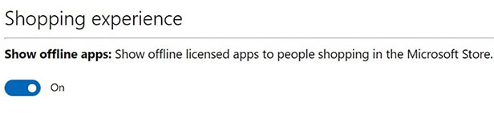

# <a name="deploy-surface-app-with-microsoft-store-for-business-and-education"></a>使用教育商務用 Microsoft Store部署 Surface 應用程式

**適用於**

- Surface Laptop (代) 
- Surface Pro 3 及更高版本
- Surface Laptop Go
- Surface Go (代) 
- Surface Book (代) 
- Surface Studio (代) 
- Surface Laptop Studio
- 配備 LTE Advanced 的 Surface Pro (型號 1807)
- Surface Pro (型號 1796)
- Surface 3 LTE
- Surface 3

Surface 應用程式是Microsoft Store應用程式，可快速存取裝置資訊，包括序號、Surface 模型名稱、UEFI 版本和相關驅動程式，提供許多 Surface 特定設定和選項的控制權。  

使用更新Windows通常會收到 Surface App，做為自動更新的一部分。 但如果您的組織正在準備部署至 Surface 裝置的圖像，您可能會想要將 Surface 應用程式 (之前稱為 Surface Hub) 納入您的影像和部署程式，而不是要求每個個別裝置的使用者從 Microsoft Store 或您的 商務用 Microsoft Store 下載並安裝應用程式。 

> [!NOTE]
> 本文不適用於 X Surface Pro。詳細資訊，請參閱部署[、管理](surface-pro-arm-app-management.md)及維護 X Surface Pro

## <a name="surface-app-overview"></a>Surface 應用程式概觀

Surface 應用程式可從應用程式免費下載[Microsoft Store。](https://www.microsoft.com/store/apps/Surface/9WZDNCRFJB8P) 使用者可以從 Microsoft Store 下載並安裝它，但如果您的組織改為使用 商務用 Microsoft Store，您必須將其新增到市面的庫存，並可能將應用程式納入 Windows 部署程式。 本文將討論這些程式。 如想進一商務用 Microsoft Store[，請參閱商務用 Microsoft Store](/microsoft-store/)。 

## <a name="add-surface-app-to-a-microsoft-store-for-business-account"></a>將 Surface 應用程式新商務用 Microsoft Store帳戶 

在使用者可以從公司的 商務用 Microsoft Store 帳戶安裝或部署應用程式之前， (應用程式) 必須先提供並授權給企業使用者。 

1. 如果您尚未這麼做，請建立商務用 Microsoft Store[帳戶](https://www.microsoft.com/business-store)。 

2. 請登錄入口網站。 

3. 啟用離線授權：****  >  按一下 **[管理設定**然後選取 [向在市中購物的使用者顯示離線授權應用程式 **」 核取方塊，** 如圖 1 所示。 有關應用程式授權商務用 Microsoft Store，請參閱教育商務用 Microsoft Store[應用程式](/microsoft-store/)。

   > [!div class="mx-imgBorder"]
   > <br/>
   *圖 1。 啟用應用程式以離線使用*

4. 新增 Surface 應用程式至您的商務用 Microsoft Store帳戶：

    * 搜尋市面上 **的應用程式** 
    
    * 在搜尋結果中顯示 Surface 應用程式之後，按一下應用程式的圖示。
    
    * 系統會顯示選取線上** (離線) **選項，如圖 2 所示。** **
    
      > [!div class="mx-imgBorder"]
      >    
      *圖 2. 選取離線授權模式，並新增應用程式至您的庫存*
    
    * 按一下 **[離線** 以選取離線授權模式。
    
    * 按一下 **[取得應用程式**以將應用程式新增到您的商務用 Microsoft Store庫存。 如圖 3 所示，您會看到一個對話方塊，提示您確認離線應用程式可以使用管理工具部署，或從公司私人商店的庫存頁面下載。
    
      > [!div class="mx-imgBorder"]
      > 
      *圖 3.離線授權應用程式確認*
      
    * 按一下**確定**。

## <a name="download-surface-app-from-a-microsoft-store-for-business-account"></a>從帳戶下載 Surface 應用程式商務用 Microsoft Store應用程式
在離線模式中將應用程式新商務用 Microsoft Store帳戶後，您可以將應用程式下載並新增為 AppxBundle 至部署共用。

1. 在 登入 商務用 Microsoft Store 帳戶 https://businessstore.microsoft.com 。

2. 按一下 **[管理>應用程式&軟體**。 系統會顯示您公司所有應用程式的清單，包括您于本文的新增 Surface 應用程式中新增到 商務用 Microsoft Store 帳戶區段的[Surface](#add-surface-app-to-a-microsoft-store-for-business-account)應用程式。

3. 在 **[動作**> 下，按一下 [ (**...**) 省略號，然後按一下 [下載以離線使用 Surface **** 應用程式。

4. 從所選**App**的可用**** 選項中選取所需的平臺和架構選項，如圖 4 所示。

    > [!div class="mx-imgBorder"]
    > <br/>
    *圖 4. 下載 App 的 AppxBundle 套件*
    
5. 按一下 **[下載**。 AppxBundle 套件將會下載。 請確定您記下下載檔案的路徑，因為本文稍後會需要該路徑。

6. 按一下 [**編碼授權或****未編碼授權選項**。 使用編碼授權選項與管理工具 ，例如 Microsoft Endpoint Configuration Manager 或當您使用 Windows設計工具來建立資源配置套件。 當您使用部署影像維護與管理 (DISM) 或部署解決方案時，選取未編碼授權選項，包括 Microsoft 部署工具組 (MDT) 。

7. 按一下 **[** 產生來產生並下載應用程式授權。 請確定您記下授權檔案的路徑，因為本文稍後會需要該路徑。

>[!NOTE]
>當您下載離線使用的應用程式 ，例如 Surface App 時，您可能會注意到頁面底部的一節標示為 **必要的架構**。 您的目的電腦必須安裝架構，才能執行應用程式，因此您可能需要針對架構 (x86 或 x64) 的每個必要的架構重複下載程式，並且將它們納入本文稍後討論的 Windows 部署中。

圖 5 顯示 Surface 應用程式所需的架構。

> [!div class="mx-imgBorder"]
> <br/>
*圖 5. Surface 應用程式所需的架構*

>[!NOTE]
>Surface App 的版本號碼和必要的架構會隨著應用程式更新而變更。 檢查最新版本的 Surface App，以及每個商務用 Microsoft Store。 請一直使用 Surface App 和由 商務用 Microsoft Store 提供的建議商務用 Microsoft Store。 使用過時的架構或不正確的版本可能會導致錯誤或應用程式當機。

若要下載 Surface 應用程式所需的架構，請遵循下列步驟：

1. 按一下 [**下載****Microsoft.VCLibs.140.00_14.0.23816.0_x64__8wekyb3d8bbwe**。 這會下載 Microsoft.VCLibs.140.00_14.0.23816.0_x64__8wekyb3d8bbwe。Appx 檔案至您指定的資料夾。

2. 按一下 [ **下載** Microsoft.NET.Native.Runtime.1.1_1.1.23406.0 **_x64__8wekyb3d8bbwe**。 這會下載 Microsoft.NET.Native.Runtime.1.1_1.1.23406.0_x64__8wekyb3d8bbwe。Appx 檔案至您指定的資料夾。

>[!NOTE]
>Surface 裝置只需要 64 位 (x64) 每個框架的版本。 Surface 裝置是原生的 64 位 UEFI 裝置，與需要 32 位架構的 32 位 (x86) Windows 版本不相容。 

## <a name="install-surface-app-on-your-computer-with-powershell"></a>使用 PowerShell 在您的電腦上安裝 Surface 應用程式
下列程式會將 Surface 應用程式規定至您的電腦，並可供之後在電腦上建立的任何使用者帳戶使用。

1. Using the procedure described in the [How to download Surface app from a Microsoft Store for Business account](#download-surface-app-from-a-microsoft-store-for-business-account) section of this article, download the Surface app AppxBundle and license file. 

2. 開始已提升權限的 PowerShell 工作階段。

    >[!NOTE]
    >如果您沒有以系統管理員的名次執行 PowerShell，會話將沒有安裝應用程式所需的許可權。
    
3. 在提升權限的 PowerShell 工作階段中，複製和貼上下列命令︰

    ```powershell
    Add-AppxProvisionedPackage –Online –PackagePath <DownloadPath>\ Microsoft.SurfaceHub_10.0.342.0_neutral_~_8wekyb3d8bbwe.AppxBundle –LicensePath <DownloadPath>\ Microsoft.SurfaceHub_8wekyb3d8bbwe_a53ef8ab-9dbd-dec1-46c5-7b664d4dd003.xml
    ```

    您 `<DownloadPath>` 從應用程式帳戶下載 AppxBundle 和授權檔案的資料夾商務用 Microsoft Store位置。

    例如，如果您將檔案下載至 c：\Temp，您執行的命令為：
    
    ```powershell
    Add-AppxProvisionedPackage –Online –PackagePath c:\Temp\ Microsoft.SurfaceHub_10.0.342.0_neutral_~_8wekyb3d8bbwe.AppxBundle –LicensePath c:\Temp\ Microsoft.SurfaceHub_8wekyb3d8bbwe_a53ef8ab-9dbd-dec1-46c5-7b664d4dd003.xml
    ```

4. 現在可在您目前的 Windows 電腦上使用 Surface app。 

   Surface App 在已配置的電腦上運作之前，您也必須提供本文前面所述之架構。 若要配置這些架構，請使用下列程式在升級的 PowerShell 會話中，您用來配置 Surface App。

5. 在提升權限的 PowerShell 工作階段中，複製和貼上下列命令︰

   ```powershell
   Add-AppxProvisionedPackage –Online –SkipLicense –PackagePath <DownloadPath>\Microsoft.VCLibs.140.00_14.0.23816.0_x64__8wekyb3d8bbwe.Appx
   ```
   
6. 在提升權限的 PowerShell 工作階段中，複製和貼上下列命令︰

   ```powershell
   Add-AppxProvisionedPackage –Online –SkipLicense –PackagePath <DownloadPath>\Microsoft.NET.Native.Runtime.1.1_1.1.23406.0_x64__8wekyb3d8bbwe.Appx
   ```

## <a name="install-surface-app-with-mdt"></a>使用 MDT 安裝 Surface 應用程式
下列程式使用 MDT 在部署時自動安裝 Surface App。 應用程式會由 MDT 在部署期間自動佈建，因此您可以利用這個程序搭配現有映像。 這是將 Surface 應用程式部署為 Windows部署至 Surface 裝置的建議程式，因為這不會降低該影像的跨平臺相容性Windows相容性。

1. 使用本文 [前面所述的程式](#download-surface-app-from-a-microsoft-store-for-business-account)，下載 Surface App AppxBundle 和授權檔案。 

2. 使用 MDT Deployment Workbench 中的新應用程式精靈，將下載的檔案以新的應用程式與來源 **檔案一併輸入**。

3. 在新增應用程式**精靈**的命令詳細資料頁面上，指定預設的**工作**目錄，而命令則指定 AppxBundle 的檔案名，如下所示：** **

   * 命令：
   
     ```console
     Microsoft.SurfaceHub_10.0.342.0_neutral_~_8wekyb3d8bbwe.AppxBundle
     ```
     
   * 工作目錄：%DEPLOYROOT%\Applications\SurfaceApp

若要讓 Surface App 在目的電腦上運作，也需要本文前面所述的架構。 使用下列程式將 Surface App 所需的架構導入 MDT，並設定為相依性。

1. 使用本文前面所述的程式，下載框架檔案。 將每個框架儲存在個別資料夾中。

2. 使用 MDT Deployment Workbench 中的新應用程式精靈，將下載的檔案以新的應用程式與來源 **檔案一併輸入**。

3. 在命令**詳細資料**頁面上，輸入您于命令欄位中下載的每個應用程式的檔案名，以及預設的**** 工作目錄。

若要將架構設定為 Surface App 的相依性，請使用以下程式：

1. 在 MDT 部署工作臺上開啟 Surface 應用程式的屬性。

2. 按一下 [ **相依性>** 選項卡，然後按一下 [ **新增**。

3. 使用您于新應用程式精靈中提供的名稱，選取每個架構的核取方塊。

在導入之後，Surface 應用程式可在部署精靈的 Windows步驟中**** 選取。 您也可以依照下列程序，在部署工作順序中指定應用程式來自動安裝應用程式：

1. 在 MDT Deployment Workbench 中開啟部署工作順序。

2. 在部署的 [State Restore]**** (狀態還原) 區段中新增新的 [Install Application]**** (安裝應用程式) 工作。

3. 選取 **安裝單一應用程式** ，然後指定 **Surface App** **為要安裝的應用程式**。

有關在部署中加入應用程式Windows，請參閱使用[MDT 準備部署](/windows/deployment/deploy-windows-mdt/prepare-for-windows-deployment-with-mdt)。
